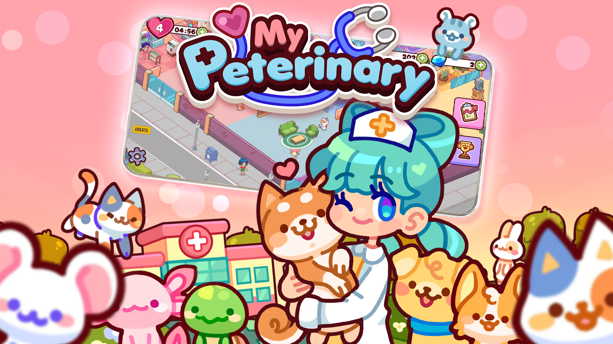
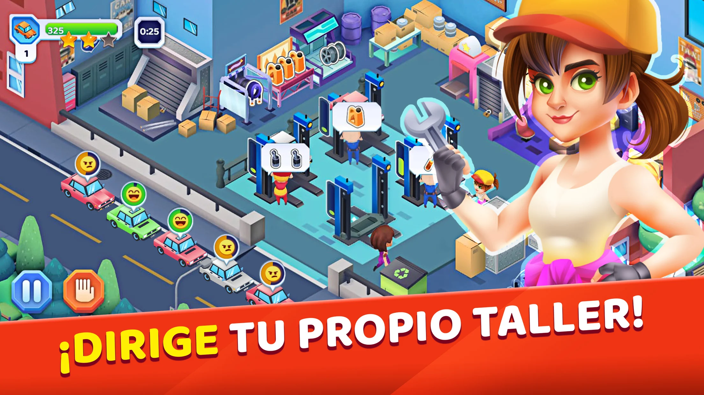
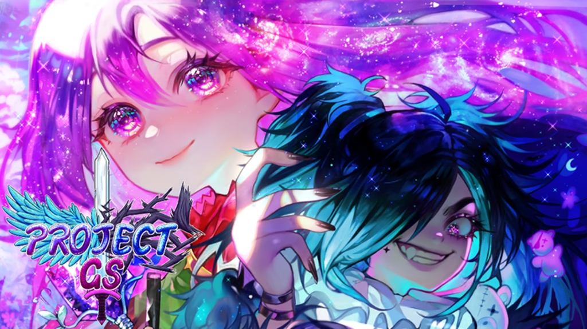

  <h1>
    Hi there 👋 I'm Luis Durán
  </h1>
  

 

## **About me:**
- 🎮 Unity developer since 2021
- 🧠 Gameplay logic
- 🏎 performance
- 🐛 Bug fixing
- 🔨 Tools testing
- 💪 Always learning and practicing
 

<table>
 <tr>

  <td width="50%">
    
   <h3 align="center">My Peterinary</h3>
   

     
     
   

  </td>

   <td width="50%">
     
   <h3 align="center">Tiny Auto Shop 2: Taller</h3>
   

     
     
   

  </td>

 </tr>
 
<!-- 
Segunda fila
-->
 <tr>
  <td width="50%">
    
   <h3 align="center">Project GS</h3>
   

     
     
   

  </td>
 </tr>

</table>

 

<!--
**luis8624/luis8624** is a ✨ _special_ ✨ repository because its `README.md` (this file) appears on your GitHub profile.

Here are some ideas to get you started:

- 🔭 I’m currently working on ...
- 🌱 I’m currently learning ...
- 👯 I’m looking to collaborate on ...
- 🤔 I’m looking for help with ...
- 💬 Ask me about ...
- 📫 How to reach me: ...
- 😄 Pronouns: ...
- ⚡ Fun fact: ...
-->
